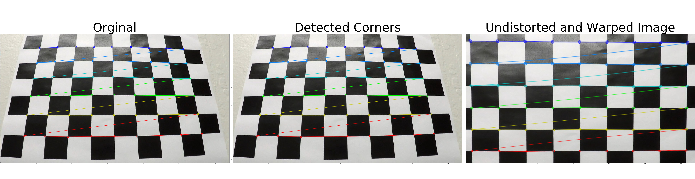
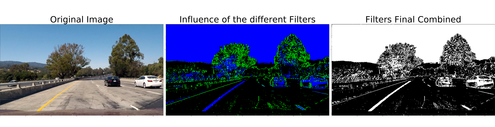
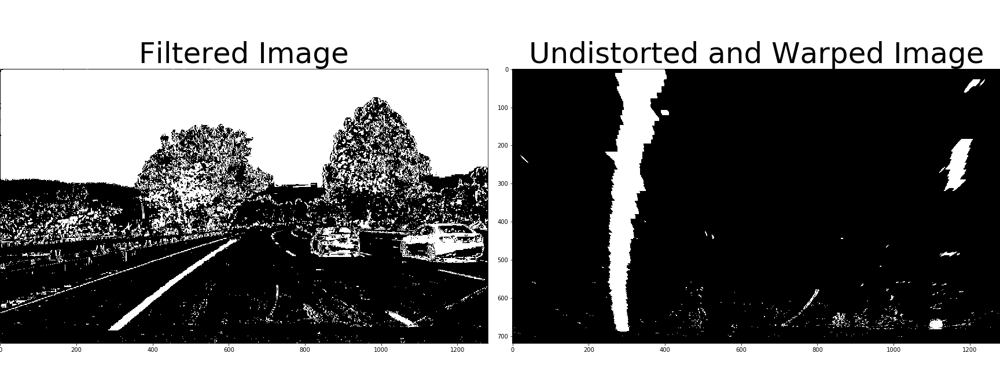
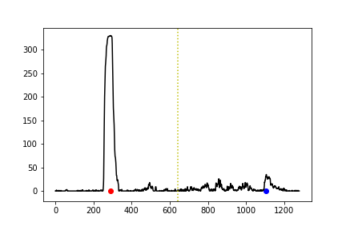
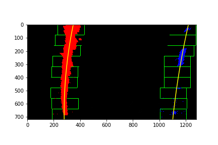
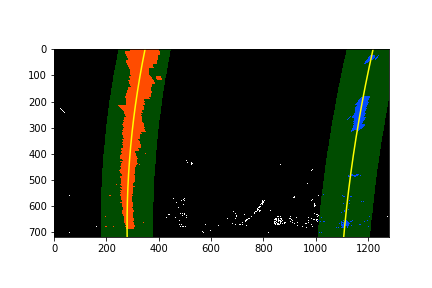
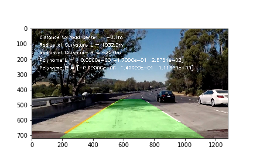

## Advanced Lane Finding

In this project, your goal is to write a software pipeline to identify the lane boundaries in a video, but the main output or product we want you to create is a detailed writeup of the project.  

The Project
---

The steps of this project are the following:

1) Compute the camera calibration matrix and distortion coefficients given a set of chessboard images.
2) Use color transforms, gradients, etc., to create a thresholded binary image.
3) Apply a perspective transform to rectify binary image ("birds-eye view").
4) Apply a distortion correction to raw images.
5) Detect lane pixels and fit to find the lane boundary.
6) Determine the curvature of the lane and vehicle position with respect to center.
7) Warp the detected lane boundaries back onto the original image.
8) Output visual display of the lane boundaries and numerical estimation of lane curvature and vehicle position.
9) **Video-Pipeline** 

###Directories and project material
The images for camera calibration are stored in the folder called `camera_cal`.  The images in `test_images` are for testing your pipeline on single frames.

*Output:* In the folder `cam_params` are the camera parameters saved. The output of the camera calibration process is stored under `output_images/camera_cal`. And all the other images for developing the pipeline are saved in `output_images`.

The `project_video.mp4` is mandatory for this project. The `challenge_video.mp4` video is an extra (and optional) challenge for you if you want to test your pipeline under somewhat trickier conditions

# Function Development
## 1) Compute the camera calibration
This part start with converting the chess board image to grayscale to reduce the image information. With `cv2.findChessboardCorners` the Corners are getting detected and with `cv2.drawChessboardCorners` drawn to the input image. 

In the next step the chessboard get warped. Four sources, as `src` saved in the code,  are marking the transformed area and the destination points (these must be listed in the same order as src points!) `dst`, the points where it should be transformed to a defined. With `cv2.getPerspectiveTransform()` the transformation Matrix `M` is computed and in combination with the predefined function `cv2.warpPerspective()` the image is getting wrapped .

<figure>
 
 <figcaption>
 

 
 
 Fig. 1.1: Camera calibration process. Left the original chess board image. In the middle the draw detected corners. On the right the unwrapped chessboard using the transformation Matrix. 
 
 </figcaption>
</figure>
 

  
## 2) Use color transforms, gradients
The function **Sobel__SSpace_pipeline** is applying a gradient and S-Channel threshold. First it applies the gradient threshold with the use of a Sobel filter in x-direction`cv2.Sobel(gray, cv2.CV_64F, 1, 0)`. Second it transforms the original image into HSL-Space `cv2.cvtColor(img, cv2.COLOR_RGB2HLS)` to apply the a threshold logic `s_binary[(s_channel >= s_thresh[0]) & (s_channel <= s_thresh[1])] = 1` for the S-Channel to detect the saturation of the street colors and with this the colored lane lines. The function finish by combining the two binary thresholds as output image.

<figure>
 
 <figcaption>
 

 
 
 Fig. 2.1: Filter process. Left the original function input image. In the middle the influence of the two filters. To visualize this image `np.dstack` is used to stack the two filters together ( blue is the influence of the S-Channel threshold). On the right is the combined threshold of the two filters seen .
 
 </figcaption>
</figure>
 

 
## 3 & 4) Apply a distortion correction to image + Apply a perspective transform to rectify binary image ("birds-eye view") 
The function *road_unwarp* is taking care of the distortion correction and of transformation of the interested road area. With `cv2.undistort` and the saved camera parameters from step 1) function input is getting undistort. For the upcoming transformation the source and destination points get defined via `np.float32([])` and the transformation Matrix `M` gets compute by`cv2.getPerspectiveTransform`. The transformation by itself to the image is done via `v2.warpPerspective`.

<figure>
 
 <figcaption>
 

 
 
 Fig. 3.1: Warp process. Left the original function input image. On the Left is the warped and undistorted road area of interest. 
 
 </figcaption>
</figure>
 

## 5) Detect lane pixels and fit to find the lane boundary.
Depending if the lanes have been detected in the last pipeline run, there will be two possible options. 

### 5.1 Lane haven't been detected in the last run
With the warped image as input the code process the image as followed. The function **histogram** 
detects the lane position start. First it sums all the detected pixels in x-direction up with `np.sum` and then second compute the starting point for the function **finde_lane_pixels** by giving out the position with the highest pixel density by `np.argmax(histogram[])`(Figure 5.1.1). The functions **find_lane_pixels** and **fit_polynomial**, which have been taken from Udacity code and modified to process the images more efficient in the pipeline. They are detecting the pixels outgoing from the start point in a defined "window" and then fitting a polynomial through the founded pixels that represent the founded lane line. For a deeper understanding have a look into the code P1 section 5 (Figure 5.1.2)

<figure>
 
 <figcaption>
 

 
 
 Fig. 5.1.1: Histogram: The applied histogram to the warped image. The red dot displays the left lane positions. The yellow dashed line in the middle, marks the middle of the image that refer to the car center. The blue dot displays the right founded lane line. 
 
 </figcaption>
</figure>
 

 
 <figure>
 
 <figcaption>
 

 
 
 Fig. 5.1.2: Sliding Windows: Well displayed the sliding windows in green and the detected pixels in red and blue with the fitted polynomial through the pixels. 
 
 </figcaption>
</figure>
 

 

### 5.2 Lane have been detected in the last run
If the lane has been detected in the last run, the process goes easier this time. The pixels getting detected by taking the old polynomial and searching in a pre-considered area around them for the new pixels. The assumption behind, is that the lane will just change incrementally to the previous founded lane. (This will be done with the function **search_around_poly**, the code has been taken from Udacity and modified to run more efficient in the pipeline)

 <figure>
 
 <figcaption>
 

 
 
 Fig. 5.2.1: Search from Prio: Well displayed, the area of search in green over the already detected pixels. 
 
 </figcaption>
</figure>
 

## 6) Determine the curvature of the lane and vehicle position with respect to center
This step contains three parts. The first one, measurers curvature of the lane in **measure_curvature_real**. On the second part, function **curvature_check**, filters out curvatures that are not part of the US-Government Street regulation. This is due to just give out real curvatures. For example, if a curvature is bigger than 1221m is will be displayed as a straight. 
And the third and last part calculates the vehicle position with respect to the lane center in the function**Lane_Position**. (This function will be founded in section 5.1. It’s there because the Figure 5.1.1 is using parts of this functions to display the lane position).

## 7) & 8) Warp the detected lane boundaries back onto the original image + Output visual display of the lane boundaries and numerical estimation of lane curvature and vehicle position.

As last step, the computed results have to be displayed on the original image. Therefore, the function **draw** will take care of wrapping the detected lines back to the original full image and visualization them. Finally, the numerical calculations from step 6 will be written in function **text_image** into the final image.

 <figure>
 
 <figcaption>
 

 
 
 Fig. 8.1: Visualized lane lines: The area between the detected lane lines is covered in green. The actual car relative position to the lane center and the curvature are displayed. 
 
 </figcaption>
</figure>
 

# Video Pipeline
## Functionality
To run the functions on a video stream, they have to be wrapped into a pipeline. The already described function are getting expanded by a smoothing and a sanity check method.
The smoothing is done by taking the mean over n-polynomial values, that holed in a deque-stack in the function **smoothing_polynominal**.
For checking the sanity, function **sanity_check**, a triple validation of the founded lane results is performed. If the deviation of the curvature is too high the check is failing. As well if the lanes are not parallel, checked if the corresponding polynomials have a too high difference. The last check is done by proofing if the lane width is in a plausible area.

The Project Example can be seen here: [Link](./output_videos/project_video.mp4). The Challenging video can be seen here: [Link](./output_videos/challenge_video.mp4).

## Discussion
**Project Video** The Pipeline works quiet well for the video. The lanes are getting smooth detected and there is no jitter of the detected lines. Improvements:
1) At the time, 40 seconds, the left line has an offset in the detection. For improving the parameters, the critical video part has been written to an image and run through the pipeline. The conclusion of this was that the pipeline detected the lane pretty well, without any offset. So, this is meaning that the parameters for the lane detection are working well. So, in a next step the smoothing over n-images could be reduced. So that the adaption would be faster to changing conditions.
2) Using Morphological Transformations to make the pipeline more robust and to cancel the filter noise.

**Challenge Video** The Pipeline works here also pretty smooth. However, the right lane line is getting hardly detected. Its visible that the lane detection is hitting/detecting areas with a high color gradient change. Like the shadow sun boarder, which is not the lane line.

Improvements:
Two possible easy ways to make the pipeline more robust:
1) Include an additional filter in the color space. To detect the lane color.
2) Change the parameter setting of the function **Sobel__SSpace_pipeline** in two ways. First to increase the `sx_thresh=(lower,higher)` lower threshold of the sobel filter. This will force the filter to dismiss the darker regions of the image for the sobel filter. Second to decrease the lower s-channel threshold `s_thresh=(lower, higher)`. With this, even the lower saturated lane values will be detected. This is important for this video because the lane line saturation will then get a bigger influence of the histogram filter and with this to the lane detection. 

 
 

 

